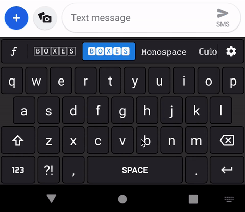

# 🅸🆁𝚛🄴🅖🅄ʟ🄰ⓡ Expressions

**Irregular Expressions is a virtual 
<kbd>k</kbd><kbd>e</kbd><kbd>y</kbd><kbd>b</kbd><kbd>o</kbd><kbd>a</kbd><kbd>r</kbd><kbd>d</kbd>
for Android devices.**     

**Add expressive flair to text everywhere,
even in places where font styles are not allowed: SMS, comments, etc.**

  

  

 

You can also find APKs in <a href="https://github.com/MobileFirstLLC/irregular-expressions/releases">releases</a>.

  
 
### Available Styles

<table width="100%">
<tbody>
<tr>
<td width="304px" align="center">bɘɿoɿɿiM</td>
<td width="304px" align="center">𝙼𝚘𝚗𝚘𝚜𝚙𝚊𝚌𝚎</td>
<td width="304px" align="center">Sᴍᴀʟʟ Cᴀᴘs</td>
</tr>
<tr>
<td align="center">🄲🄻🄴🄰🅁 🄱🄾🅇🄴🅂</td>
<td align="center">🅱🅾🆇🅴🆂</td>
<td align="center">𝕔𝕦𝕥𝕠𝕦𝕥</td>
</tr>
<tr>
<td align="center">𝔒𝔩𝔡 𝔈𝔫𝔤𝔩𝔦𝔰𝔥</td>
<td align="center">𝕺𝖑𝖉 𝕰𝖓𝖌𝖑𝖎𝖘𝖍 𝕭𝖔𝖑𝖉</td>
<td align="center">𝒮𝒸𝓇𝒾𝓅𝓉</td>
</tr>
<tr>
<td align="center">𝓢𝓬𝓻𝓲𝓹𝓽 𝓑𝓸𝓵𝓭</td>
<td align="center">ⓒⓛⓔⓐⓡ ⓒⓘⓡⓒⓛⓔⓢ</td>
<td align="center">🅒🅘🅡🅒🅛🅔🅢</td>
</tr>
<tr>
<td align="center">Ｅｘｔｒａ  ｗｉｄｅ</td>
<td align="center">uʍop ǝpᴉsd∩</td>
<td align="center">𝐒𝐞𝐫𝐢𝐟 𝐁𝐨𝐥𝐝</td>
</tr>
<tr>
<td align="center">𝑆𝑒𝑟𝑖𝑓 𝐼𝑡𝑎𝑙𝑖𝑐</td>
<td align="center">𝑺𝒆𝒓𝒊𝒇 𝑩𝒐𝒍𝒅 𝑰𝒕𝒂𝒍𝒊𝒄</td>
<td align="center">𝗦𝗮𝗻𝘀 𝗦𝗲𝗿𝗶𝗳 𝗕𝗼𝗹𝗱</td>
</tr>
<tr>
<td align="center">𝘚𝘢𝘯𝘴 𝘚𝘦𝘳𝘪𝘧 𝘐𝘵𝘢𝘭𝘪𝘤</td>
<td align="center">𝙎𝙖𝙣𝙨-𝙎𝙚𝙧𝙞𝙛 𝘽𝙤𝙡𝙙 𝙄𝙩𝙖𝙡𝙞𝙘</td>
<td align="center">U͟n͟d͟e͟r͟l͟i͟n͟e͟d͟</td>
</tr>
<tr>
<td align="center">̶S̶̶t̶̶r̶̶i̶̶k̶̶e̶̶t̶̶h̶̶r̶̶o̶̶u̶̶g̶̶h̶</td>
<td align="center">̵L̵i̵t̵e ̵S̵t̵r̵i̵k̵e̵s̵</td>
<td align="center">Clap👏Clap👏</td>
</tr>
<tr>
<td align="center">̐̈H̐̈a̐̈p̐̈p̐̈y ̐̈F̐̈a̐̈c̐̈e̐̈s̐̈</td>
<td align="center">͛T͛h͛u͛n͛d͛e͛r͛s͛t͛r͛u͛c͛k͛</td>
<td align="center"≯S̸l̸a̸s̸h̸e̸d̸</td>
</tr>
<tr>
<td align="center">̼M̼u̼s̼t̼a̼c̼h̼e̼</td>
<td align="center">͙S͙t͙a͙r͙r͙y ͙N͙i͙g͙h͙t͙</td>
<td align="center">Oяցαηιɕ</td>  
</tr>
<tr>
<td align="center">SpOnGeMoCk</td>
<td align="center">ˢᵘᵖᵉʳᵗᶦⁿʸ</td>
<td align="center">z̴̪͇͑̏́̾̈́̈́ͅą̶͕̠͓̲̖͔̤̗̭̌̀̾̈̅͐́̽́̉͌̀̂̈̓͝l̸̳͙̪̮̖̙̥͇͉͚̭͙͖͉͆̒͠g̶̣̱̖̦̝͉̗̯̀͋̓͜o̶̻͉̬̼͊͐́̄̕</td>
</tr>
<tr>
<td align="center">🇲​🇦​🇷​🇮​🇹​🇮​🇲​🇪​</td>
<td align="center">Regular</td>
<td></td>
</tr>
</tbody>
</table>

### Translations

If you would like to use the keyboard in your native language, consider translating it.

**[Translate on Weblate]**

Current translation status:

[Translate on Weblate]: https://hosted.weblate.org/engage/irregular-expressions/

### Privacy Policy

The app collects no data about the user.
There is no tracking, analytics, or any other types of intrusions.
Feel free to inspect the source code to verify this statement.
